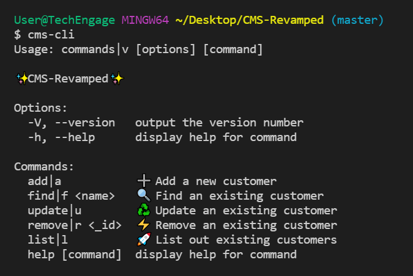
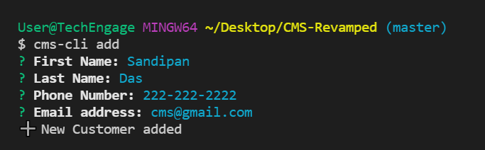
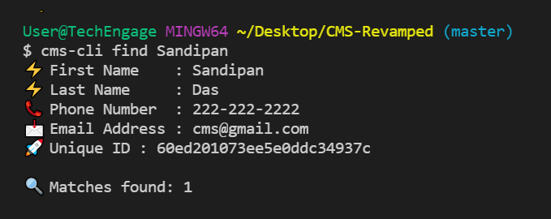
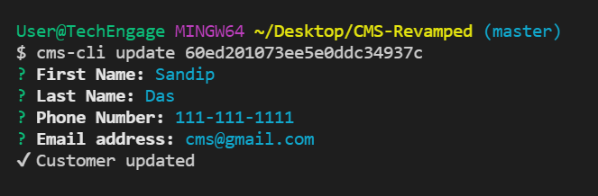
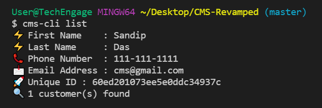

# Customer Management Interface⚡

<p align="center">
   
</p>

[](https://GitHub.com/Naereen/StrapDown.js/graphs/commit-activity)

<!-- BUILT WITH -->

## Built With

<p align="left">
    
    
    
    
</p>  

---

## 🔥 Screenshots

| `cms-cli` |
| - |
|  |

| `cms-cli add` | `cms-cli find <name>` |
| - | - |
|  |  |

| `cms-cli update <id>` | `cms-cli list` |
| - | - |
|  |  |

---

<!-- INSTALLATION -->
## How to Install Locally

**1. Fork and clone this repository using**

```
  git clone https://github.com/sandip2224/CMS-CLI_Revamped.git
  cd CMS-CLI_Revamped/
```  

**2. Install required dependencies using**

```
   npm install
```

**3. Create global symlink using**

```
npm link
```

## Commands and syntaxes

- Add a new customer

  `
  cms-cli add
  `
- Find an existing customer

  `
  cms-cli find <name>
  `
- Update an existing customer credentials

  `
  cms-cli update <_id>
  `
- Remove an existing customer

  `
  cms-cli remove <_id>
  `
- List out all customers

  `
  cms-cli list
  `

---

## Contributing

If you'd like to contribute, please **fork** the repository and then raise a PR with necessary changes. Thank you.

---

## 🤎 Found this project interesting?

If you found this project useful, then please consider leaving a :star: on Github
and sharing it with your friends via social media.

---

## :man: Project Created & Maintained By-
  - [Sandipan Das](https://linkedin.com/in/sandipan0164/)
